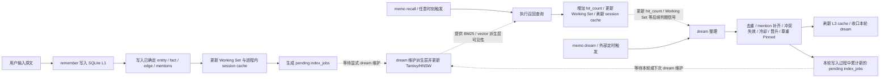

# 记忆引擎架构

**日期：** 2026-04-22  
**范围：** 主架构边界、系统分层、命令流程、模型职责、记忆生命周期

## 文档目的

本文档是 memo-brain 的主架构文档，只回答三类问题：

- 系统的目标形态是什么；
- 当前推荐的运行边界与命令流程是什么；
- 一条记忆从写入到沉淀，生命周期如何推进。

本文档不负责公开命令命名哲学，也不负责阶段排期或任务清单。

- 命令语义与参数暴露原则，见 [`command-philosophy.md`](./command-philosophy.md)；
- 当前实现差距与后续推进，应直接以本文件约束和当前代码实现交叉判断，而不是再依赖独立路线图文件。

## 目录

- [定位](#定位)
- [目标与非目标](#目标与非目标)
- [核心原则](#核心原则)
- [系统分层](#系统分层)
- [技术栈与职责](#技术栈与职责)
- [多轴记忆模型](#多轴记忆模型)
- [模块划分建议](#模块划分建议)
- [数据模型](#数据模型)
- [性能与预算](#性能与预算)
- [命令运行边界](#命令运行边界)
- [并发与一致性边界](#并发与一致性边界)
- [正式流程图](#正式流程图)
- [命令级流程](#命令级流程)
- [记忆生命周期](#记忆生命周期)
- [取舍](#取舍)
- [长期方向](#长期方向)

## 定位

memo-brain 的目标不是继续堆 CLI 命令，而是收敛为一个**单程序、真相源唯一、索引可重建、分层沉淀的记忆引擎**。

它要解决的是三个根问题：

- 实时交互场景下，检索链路太重，响应时间不可接受；
- 记忆只是平面堆积，缺少分层、沉淀与长期整理机制；
- 模型、索引和存储职责混杂，导致系统边界不清。

## 目标与非目标

### 目标

- 单程序内完成存储、检索、索引、整理和状态恢复；
- 以低延迟为优先，优先服务即时交互；
- 记忆支持 `L1 / L2 / L3` 成熟度轴，并通过 Working Set 活跃轴与 Pinned 保护轴补充表达；
- 真相源唯一，所有索引与缓存都可重建；
- 快路径与慢路径明确分离。

### 非目标

- 分布式、高可用、云原生部署；
- 团队共享知识库的复杂权限与同步；
- 把本阶段做成通用数据库或独立图数据库；
- 把 LLM 放进高频即时交互命令的默认路径；
- 为了“纯本地”而强行内置体积庞大的模型运行时。

## 核心原则

- 真相只存在 SQLite；
- 文本索引、向量索引和缓存都只是派生层；
- 即时交互命令默认轻量、快速返回；
- 重型整理和复杂抽取显式进入 `dream`；
- 检索默认快路径，深搜按需升级；
- 复杂事实不要求在写入瞬间全部抽准。

## 系统分层

整个引擎分成五层。这里的“层”是实现职责分层，不等同于用户可见的记忆成熟度分层：

- `Storage Layer`
  - SQLite 真相源
- `Index Layer`
  - Tantivy 文本索引
  - HNSW 向量索引
- `Reasoning Layer`
  - alias、exact、recency、graph hop、融合排序、MMR
- `Dream Layer`
  - 整理、去重、冲突收口、晋升、归档、冷却
- `Session Layer`
  - 进程内 session cache、最近命中、当前会话热点

对外产品心智只保留：

- L1 / L2 / L3：记忆成熟度轴；
- Working Set：最近活跃横切视图；
- Pinned：显式保护轴。

进程内 session cache 可以作为即时命中的内部优化，但不应被描述成 L0 产品层，也不应要求用户理解。

## 技术栈与职责

### 真相源

- `SQLite`
- 推荐通过 `rusqlite` 访问

职责：

- 唯一业务数据源；
- 保存 episode、entity、fact、edge、layer、index state；
- 承担最终可追溯性。

### 文本检索

- `Tantivy`

职责：

- BM25、短语命中、关键词检索；
- 作为第一层高精度召回；
- 命中后仍需回 SQLite 取真相记录。

### 向量检索

- 进程内 ANN，当前使用 `HNSW`

职责：

- 语义召回；
- 命中后回 SQLite 取真实记录；
- 与真相源严格分离，可全量重建。

驻留策略：

- 当前参考策略是启动时读入持久化向量 manifest，并在进程内重建 HNSW 结构常驻内存；
- 它不是 mmap 驱动的按需懒加载索引；
- 当前写出的 HNSW sidecar 文件属于派生产物和后续 reload 演进边界，不是当前启动路径的权威输入；
- 在 `hnsw_rs 0.3.4` 下直接 reload sidecar 会把 `Hnsw` 生命周期绑定到 loader；若后续启用 sidecar reload，需要先设计安全的 loader 持有模型，不能通过泄漏或 unsafe 绕过；
- 这样做的好处是查询路径简单、ANN 延迟稳定，更容易满足向量查询预算；
- 代价是向量记录与 HNSW 图都会占用常驻内存，记忆规模和向量维度继续增大后，内存成本会线性上升；
- 粗略估算时，仅 float32 向量本体就约等于 `记录数 * 维度 * 4 bytes`，例如 `100000 * 768 * 4` 约为 `293 MB`，再叠加 HNSW 邻接结构、记录元数据与进程开销后，常驻内存会继续上浮；
- 因此当记录量进入十万级、向量维度维持在数百到上千维，或单索引常驻内存已逼近宿主机可接受预算时，就应开始评估后续的混合驻留策略；
- 因此当前架构接受“单程序内存换查询延迟”的取舍，但如果未来规模继续增长，向量索引的内存占用会成为需要单独优化的边界。

### 模型层

#### embedding

职责：

- 为 episode / entity / fact 生成向量；
- 为 recall query 生成查询向量；
- 支撑向量召回与向量索引维护。

运行策略：

- 默认接 provider-based 在线服务；
- 属于基础设施层，不属于 LLM 整理层；
- 生成出的向量数据允许被 `recall` 消费，也允许被 `dream` 的派生层维护流程写入或刷新。
- 默认 `recall` 不现场调用 query embedding provider，只使用已经沉淀到本地的向量材料；
- 如果本地向量不可用，系统应退回 exact / alias / BM25 / graph 等本地路径，而不是拖垮快路径。

#### rerank

职责：

- 在候选已经召回之后，对少量候选做二次排序。

运行策略：

- 默认不常驻；
- 当前默认 `recall` 和 `--deep` 都不触发；
- 默认接 provider-based 在线服务；
- 不参与真相源写入；
- 如后续保留，优先作为离线评估或显式维护能力，不能进入默认查询路径。

#### LLM

职责：

- 复杂实体/事实抽取；
- 多关系拆分；
- 冲突判断辅助；
- dream 阶段的重型结构化整理。

运行策略：

- 不进入 `remember / recall / reflect / state` 默认路径；
- 主要服务于 `dream` 这类慢路径命令。

## 多轴记忆模型

### 成熟度轴

#### L1 浅层

原始 episode 证据层，可重复、可脏、可冲突，主要用于保留近期证据，也是 dream 的主要输入。

#### L2 中层

经整理后形成的稳定事实层，具备实体、别名、关系和时间归一化，是结构化检索与图扩展的主工作层。

#### L3 深层

长期稳定、命中频繁、价值高的核心记忆层，启动时优先加载。

当前 L3 启动预加载的上限也应受配置约束，而不是无界加载。默认应受 `l3_cache_limit` 这类显式上限控制。

这里的缓存策略应再说清一步：

- `l3_cache_limit` 当前表达的是“启动或刷新时按排序取前 N 条装入缓存”的上限；
- 推荐排序依据应是**L3 热度排序**，而不是单独依赖某一个维护字段；
- 更合理的参考策略是：先按 `hit_count DESC`，再按统一活跃时间视图排序；
- 这里的“活跃时间”建议统一理解为概念上的 `activity_at`，它不是独立落库字段，而是一个派生视图：对 episode / entity 近似为 `last_seen_at`，对 fact / edge 近似为 `updated_at`；
- 因此文档里若讨论排序语义，优先使用“活跃时间”或 `activity_at` 这一概念，而不要把它误解成新增数据库列；
- 单独使用 `memory_layers.updated_at DESC` 只能算当前实现上的简化近似，不应被当作长期热点选择语义；
- 它不是运行时无限增长后再做 LRU 驱逐的缓存模型；
- 因此 L3 的构成更接近受限的预加载热点集，而不是通用动态缓存。

### 活跃度轴：Working Set

Working Set 是持久化的最近活跃横切视图，横切 L1 / L2 / L3，不是 L0，也不是进程内 session cache。

它的来源包括：

- `remember` 写入的新 episode 和手工结构化记录；
- `recall` 最终命中的 active 记录；
- `reflect` 查看过的记录；
- `dream` 新生成、晋升、合并保留或显式更新的 active 记录。

Working Set 只提供小幅最近活跃加权，不能压过明确匹配，也不能替代成熟度层级。

### 保护轴：Pinned

Pinned 是显式保护标记，横切 L1 / L2 / L3，不代表更高成熟度，也不引入 L4。

Pinned 记录默认由用户或上层调用显式设置。`dream` 在自动冷却、归档、失效和合并时必须尊重 Pinned；`recall` 可以轻量加权 Pinned，但不能让不匹配内容强行排前。

### 内部短期缓存：session cache

进程内 session cache 用于补充短期最近上下文和即时热度，只存在于当前进程内。它可以参与 recall 候选收集和最近命中加权，但它不是用户可见的记忆层，也不是 Working Set 的唯一来源。

## 模块划分建议

- `core`
- `storage`
- `index_text`
- `index_vector`
- `nlp`
- `retrieve`
- `dream`
- `session`
- `app`

原则是：每层只做一类事，不把查询、写入、dream、session 和模型调用继续堆回一个中心文件。

依赖方向应保持为：

- `app` 可以依赖所有下层模块，但不承载核心业务规则；
- `retrieve` 依赖 `storage`、`index_text`、`index_vector`、`session` 与 `nlp`；
- 派生层维护逻辑应视为 `Index Layer` 的维护编排器：它读取 `index_jobs`，分别调度 `index_text` / `index_vector` 更新，但不向用户暴露独立公开命令；
- `dream` 依赖 `storage`、`session` 和派生层维护能力，并可按需调用 `nlp`，但不应反向依赖 `retrieve`；
- `index_text`、`index_vector`、`nlp` 不依赖 `app`；
- `core` 不依赖其他业务模块，应作为领域模型与规则底座。

两套划分之间的映射关系应理解为：

- `storage` 对应 `Storage Layer`；
- `index_text` 和 `index_vector` 对应 `Index Layer`；
- 派生层维护能力位于 `Index Layer` 上方，负责把 `index_jobs` 翻译成 text/vector 更新；当前代码中可继续保留内部 `restore` / `restore_full` helper 作为实现复用点，但它们不是公开产品命令，也不应重新包装成 `restore` / `rebuild` 用户流程；
- `retrieve` 是 `Reasoning Layer` 的主实现承载；
- `dream` 对应 `Dream Layer`；
- `session` 对应 `Session Layer`，只承载进程内 session cache 等短期运行态；
- `nlp` 为横切支持模块，服务 `retrieve` 与 `dream`，本身不单独等于某一层；
- `core` 负责跨层共享的领域模型、枚举和规则。

## 数据模型

### 核心表

- `entities`
- `entity_aliases`
- `episodes`
- `facts`
- `edges`
- `mentions`
- `memory_layers`
- `index_state`

与这些核心表配套，还需要有独立的 `index_jobs` 队列表，用于记录 text/vector 派生层的待处理更新。

`index_jobs` 的最小字段清单也应明确为：

- `id`
- `record_type`
- `record_id`
- `index_type`
- `op`
- `status`
- `attempts`
- `last_error`
- `created_at`
- `updated_at`

### 关键字段

- 稳定 `id`
- `created_at`
- `updated_at`
- `last_seen_at`
- `confidence`
- `source_episode_id`
- `archived_at` / `invalidated_at`

`confidence` 的语义约定应保持一致：

- 取值范围固定在 `[0.0, 1.0]`；
- 手工输入默认采用较高基线；
- provider 抽取结果按 provider 返回值进入系统；
- dream 的晋升与冲突判断不会只看 `confidence`，而是与支持度、时间跨度、命中频率、层级和更新时间一起参与决策。

### 表职责说明

- `index_state`：记录 text/vector 派生层当前健康状态、文档量与最近一次维护结果；
- `index_jobs`：记录待消费的 text/vector upsert/delete 任务；
- `entity_aliases`：记录 entity 的别名集合，供 exact / alias 路径、文本索引和实体展示消费；
- `mentions`：记录 episode 与 entity 的提及关系，作为后续结构化整理与图扩展的证据层连接。
- `memory_layers`：成熟度层级、生命周期状态、Working Set 与 Pinned 元数据的权威源；业务表上保留当前 `layer` 只作为直接查询优化字段和镜像，不单独作为判定依据。更新层级或状态时，应在同一事务内同步更新 `memory_layers` 与业务表，避免双写漂移。

### 图关系

图结构直接落在 SQLite 表里：

- `edges(subject_entity_id, predicate, object_entity_id, weight, valid_from, valid_to, source_episode_id)`

轻量多跳可用 `WITH RECURSIVE`，热点邻接可缓存到内存。

`edge` 的失效语义也应区分两类：

- `valid_from / valid_to` 表达关系的时间边界，偏向“这条关系在什么时候成立”；
- `invalidated_at` / `archived_at` 表达记录状态，偏向“这条记录是否仍应作为 active 候选参与检索”；
- 当前 recall 的候选过滤首先由 active 状态控制，也就是排除 `archived` / `invalidated` 记录；
- `valid_to` 本身更多用于保留历史边界，不单独替代 active 状态过滤；如果一条 edge 因冲突或归档退出主检索路径，通常会伴随状态字段更新。

最低索引要求应明确为：

- `edges(subject_entity_id)`；
- `edges(object_entity_id)`；
- 如谓词过滤成为高频路径，再补 `(subject_entity_id, predicate)` 或 `(object_entity_id, predicate)` 组合索引。

## 性能与预算

目标不是云上吞吐，而是单程序内的稳定低延迟。

- session cache 命中：`< 1ms`
- alias / exact：`< 5ms`
- Tantivy BM25：`5ms - 20ms`
- 向量 ANN：`10ms - 40ms`
- 轻量图扩展：`5ms - 20ms`
- 快路径总预算：`20ms - 80ms`

这里的预算解释必须保持一致：

- `session cache < 1ms` 描述的是进程内短期缓存命中检查这一条子路径本身的成本，不等于“只要 session cache 命中，整个 recall 就会在 1ms 内完成”；
- 同理，BM25、ANN、graph 扩展这些数字也主要描述各自子路径或组件阶段的预算，而不是默认串行相加后的总延迟；
- 当前 recall 采用“有界候选收集 + 统一融合排序”的策略，因此快路径总预算 `20ms - 80ms` 是对整条 recall 链路的参考目标，而不是对任一单独命中信号的承诺。

这里的 ANN 预算只描述**本地索引查询本身**，不包含 provider embedding 网络调用。

因此，`20ms - 80ms` 这条快路径总预算默认针对**不含实时 query embedding 网络调用**的本地召回链路。当前公开 `recall` 不应为了补齐向量路径而现场请求 provider；缺少本地向量材料时，应直接使用 exact / alias / BM25 / graph 等本地路径。

超过预算时，优先策略应是：

- 退回非向量路径；
- 缩小候选池和跳数；
- 避免默认升级 deep。

## 命令运行边界

### 即时交互命令

- `memo awaken`
- `memo remember`
- `memo recall`
- `memo reflect`
- `memo state`

要求：

- 默认不调用 LLM；
- 不执行重型整理；
- 快速返回；
- 以“先可用、后完善”为原则。

### 整理维护命令

- `memo dream`

要求：

- `dream` 负责重型整理、复杂模型调用和派生层维护；
- 允许比即时命令更慢；
- 内部 index repair bookkeeping 不暴露成独立用户流程。

## 并发与一致性边界

当前推荐并发模型应明确为：

- 当前默认使用形态仍是命令式单程序 CLI，也就是单次命令启动一个进程、完成后退出；
- 因此这里讨论的并发边界，主要适用于外部并行调用多个 CLI 实例、宿主调度器并发触发命令，或未来把同一套引擎嵌入长生命周期进程时的契约约束；

- SQLite 使用 WAL 模式；
- 真相源写入通过单连接 + 互斥串行化；
- text/vector index 的写入各自通过独立互斥保护；
- `remember` 与 `dream` 可以在逻辑上并发发生，但对同一派生层的实际更新应序列化。

这里的互斥也应区分层级：

- 在同一长生命周期进程内，可以用内存互斥保护 text/vector index 写入；
- 如果宿主环境可能并发启动多个 CLI 实例，对同一索引目录的写入则应进一步依赖进程级互斥，例如文件锁，而不能只依赖单进程内存锁。

这意味着：

- `remember` 负责写真相源并排队 `index_jobs`；
- `dream` 的派生层维护阶段负责安全消费 `index_jobs`；
- 二者之间的契约重点不是“绝对同步完成”，而是“真相源先成功，派生层随后追上，且不会把队列消费成损坏状态”。

对 `dream` 还应增加一条原子性约束：

- 不要求整轮 `dream` 作为单一大事务提交；
- 但同一条记录的层级/状态变更，尤其是业务表与 `memory_layers` 的双写，应以单记录级事务原子完成；
- 如果 `dream` 中途崩溃，系统应允许后续重复执行继续收敛，而不是留下不可恢复的半晋升状态。

`dream` 内部整理阶段与派生层维护阶段的关系也应写清：

- 派生层维护只能消费自己读取时已经提交完成的 `index_jobs` 快照；
- `dream` 整理过程中新增的 `index_jobs`，如果出现在本轮维护快照之后，应自然留到下一次 `dream` 维护消费；
- 因此约束重点是“job 入队必须原子提交，维护阶段不读取未提交状态，同一索引写入保持串行化”。

## 正式流程图

## 命令级流程

### `memo awaken`

职责：初始化本地记忆空间。

流程：

1. 固定创建或确认用户目录下的 `~/.memo` 配置根；
2. 解析实际数据目录，默认使用 `~/.memo/data`，仅允许通过 `MEMO_DATA_DIR` 或 `~/.memo/config.toml` 中的 `storage.data_dir` 覆盖；
3. 创建数据目录；
4. 仅在缺失时向 `~/.memo` 写入配置模板；
5. 初始化 SQLite 与索引目录；
6. 返回初始化摘要。

重复执行行为也应明确：

- `awaken` 应保持幂等；
- `~/.memo/config.toml` / `~/.memo/providers.toml` 默认保留，不应覆盖用户修改；
- 再次执行时更接近“补齐缺失模板并确认空间可用”，而不是“重置现有记忆空间”。
- 数据目录如果被覆盖到其他位置，配置文件位置也不应随之迁移。

### `memo remember`

职责：快速写入一条新的原始记忆证据。

流程：

1. 接收原始文本；
2. 合并显式传入的 `--entity` 与 `--fact`；
3. 允许做轻量、确定性的本地补充；
4. 写入 episode 到 SQLite 真相源；
5. 对在 remember 阶段已经明确得到的 entity / fact / edge 立即写入真相源；
6. 为 episode 与已确定 entity 立即写入 `mentions`；
7. 持久化 Working Set，并更新进程内 session cache；
8. 生成 text/vector 索引更新任务；
9. 立即返回。

这里的“轻量、确定性的本地补充”应有明确边界：

- 允许的正例包括：时间戳规范化、字符串归一化、fact 三元组的规范键生成、基于本地规则的 entity 名称去空白/大小写归一；
- 也允许做不依赖网络调用或概率模型推断的实体解析补足，例如为了落 fact / edge，需要把 `subject` / `object` 解析到具体 entity 记录；
- 不允许的反例包括：外部 API 调用、复杂推理、需要长链路模型参与的开放式抽取、会显著拖慢 remember 的重型聚类整理。

entity resolution 的规则也应明确：

- 如果用户传入了 `--fact`，而对应 `subject` / `object` 没有在显式 `--entity` 中给出，remember 仍可为它们创建或 upsert 最小实体记录；
- 当前参考策略是基于规范化名称直接命中已有 entity，否则创建最小 `unknown` entity，再把 fact 和 edge 关联到这些 entity 主键；
- 也就是说，remember 阶段的 edge 创建依赖本地 entity resolution，但不要求用户总是显式把 entity 也一并传入。

`unknown` entity 也应有最小定义：

- `unknown` 是当前合法的保底 `entity_type` 取值之一，用于表示“已经需要实体主键参与关系建模，但暂时没有更具体类型”；
- 它首先是一个可引用、可晋升、可参与 recall 的普通 entity，而不是异常对象；
- 当前架构不要求对 `unknown` entity 做特殊召回降权，也不要求 dream 必须自动把它改写成更具体类型；
- 更具体的类型补全属于后续增强能力，可以由后续抽取、人工补充或更强整理逻辑完成。

`entity_aliases` 的写入时机也应明确：

- remember 阶段在创建或 upsert entity 时，就应把手工输入中的别名一并写入 `entity_aliases`；
- 如果 dream 的慢路径 provider extraction 形成了新的别名信息，也应在那一阶段把新 alias 持久化；
- recall 的 alias 路径消费的就是这批持久化别名，而不是临时会话态；
- dream 不应每轮都默认重写 alias 表，只有真实产生了新的 alias 信息时才补充。

默认不做：

- LLM extraction；
- 完整 dream；
- 派生层全量维护；
- 同步完成所有重后处理。

立即可见性约定：

- `reflect` 立即可见；
- `exact / alias / session cache` 路径立即可见；
- `BM25 / vector` 属于派生层能力，只有在对应 index jobs 被消费后才保证可见。

### `memo recall`

职责：快速回忆相关记忆。

流程：

1. session cache；
2. L3；
3. exact / alias；
4. BM25；
5. 已有本地向量召回（仅在本地向量索引已建立且已有向量材料时执行）；
6. 融合 recency、layer、Working Set、Pinned、hit frequency、graph hop；
7. 评估轻路径结果是否已经足够确定：
   - 若是：直接返回；
   - 若结果模糊：升级 deep，扩大候选池、增加 hop，再返回。

当前参考策略不是“前面命中就立刻硬短路返回”，而是：

- 先收集 session cache、L3、exact/alias、BM25、vector 等候选；
- 旧文档和部分实现 reason 中的 `L0` 指进程内 session cache，不是用户可见的记忆层；公开文档应称为 session cache；
- 再统一融合排序；
- 只有在轻路径结果已经足够确定时，才不进入第二次 deep 扩展。

当前参考实现的收集方式也应讲清：

- 候选路径当前按**有界、顺序**方式收集，而不是默认并行 fan-out；
- 因此预算成立的前提不是“所有子路径都并行完成”，而是候选规模受限、部分路径可被跳过、以及默认不进入网络 embedding 路径；
- 如果未来需要更稳定地压低端到端延迟，再把 BM25 / vector / graph 扩展改成并行收集，属于实现优化方向，而不是当前前提。

命中后的热度写回时序也应明确：

- 当前参考策略是先完成候选收集、融合与结果裁剪，再对最终返回结果做小批量同步写回；
- 也就是说，`hit_count` 的 SQLite 写入属于 recall 尾部的收口动作，而不是在 session cache / BM25 / vector 子路径收集中途穿插执行；
- session cache 的即时热度更新可以留在内存态中先完成，Working Set 与少量命中计数再同步落库，用来反馈后续的层级、热度与冷却判断；
- 如果未来命中写回成为显著延迟瓶颈，可以把这一步演进为批量或延迟刷写，但对外语义仍应保持“被召回会影响后续热度判断”。

候选过滤规则也应明确：

- recall 默认只面向 active 记录工作；
- 已 `archived` 或 `invalidated` 的 episode / entity / fact / edge 不应进入候选集；
- 因此 dream 做出的归档、失效和冲突收口，会直接体现在后续 recall 的可见结果里，而不是只停留在元数据层。

也就是说，session cache / L3 / exact / alias 属于**决定性强信号**，它们通过高基线分和 deep 升级抑制来主导结果，而不是通过“遇到即返回”来实现。Working Set 和 Pinned 是横切加权信号，只能辅助排序，不能让弱匹配压过明确匹配。

融合排序的参考机制应明确为：

- 候选先按来源信号写入基线分；
- 再叠加 recency、layer、hit frequency、graph hop 等加权信号；
- 默认不现场 rerank；
- 最终再通过 MMR 做去重选择，而不是从一开始就把 MMR 当主排序器。

graph hop 在召回里同时扮演两类角色，这一点应单独说清：

- 一方面，它会为通过图邻接拿到的候选附加基于 hop 数的分值信号；
- 另一方面，它本身也可以作为候选扩展机制，把图邻近节点加入候选池；
- 区别不在于“快路径只打分、deep 才扩展”，而在于快路径只允许更小的 hop 上限和候选规模，deep 才放大这两个窗口。

图扩展的中间邻接截断也应明确：

- `graph_limit` 不只约束最终并入候选池的新增结果，也约束每一层 hop 扩展时允许继续展开的邻接规模；
- 如果某个 seed entity 在单跳上就拥有远超预算的邻接节点，系统应先按图信号或稳定性规则做局部截断，再继续扩展后续 hop；
- 每一 hop 的邻接展开各自受 `graph_limit` 约束，多 hop 的累计结果在去重后再并入候选池，而不是把所有 hop 的原始展开量简单相加视为最终候选规模；
- 也就是说，图扩展不应先无界展开再在末尾统一裁剪，否则会直接破坏即时路径预算。

“结果模糊”的参考判定应明确为：

- 无结果；
- 只有一个结果但分数偏弱；
- 前两名分数差距过小；
- 不存在 session cache / L3 / exact / alias 这类决定性理由。

这里不固定具体阈值。阈值与分段规则属于实现调参范围，应由实现根据召回质量与预算约束决定，而不是在架构文档里写死数值。

图扩展跳数上限也应明确为参考默认值：

- 快路径默认最多 `1 hop`；
- `--deep` 或自动升级 deep 时，默认最多 `2 hops`；
- 超过这一范围应视为重型检索，不进入即时命令默认路径。

融合前候选池的规模也应有明确上限：

- 当前参考上限是 BM25 与向量召回各自取 `top(limit * 6)`，deep 时扩大到 `top(limit * 12)`；
- 图扩展候选的新增规模默认受 `graph_limit` 约束，快路径参考值为 `limit * 4`，deep 参考值为 `limit * 8`；
- 因此 MMR 面对的应是经过来源限流与去重后的有界候选池，而不是无上限混排。

### `memo reflect`

职责：查看单条记忆详情。

流程：

1. 从 SQLite 读取指定记录；
2. 返回正文、结构化事实、层级、命中、来源和有效性状态；
3. 结束。

边界也应明确：

- `reflect` 默认直读指定记录，不复用 recall 的 active 候选过滤；
- 如果目标记录已经 `archived` 或 `invalidated`，仍应返回其内容与当前状态，帮助用户理解它为什么退出主检索路径；
- 只有在记录不存在时，`reflect` 才应返回未找到。

### `memo state`

职责：查看系统状态。

流程：

1. 读取 SQLite 统计；
2. 读取 L1 / L2 / L3 成熟度摘要、Working Set 和 Pinned 状态；
3. 读取 text/vector 索引状态；
4. 返回 `status` / `message` / `next` 摘要，并在需要时通过诊断信息包含 pending / failed `index_jobs` 的数量级提示。

普通用户输出不应要求用户理解 `index_jobs`、`index_state`、session cache 或 restore/rebuild。可执行动作应收敛为配置 provider、运行 `memo dream` 或无需处理。

### `memo dream`

职责：执行重型记忆整理与生命周期推进。

流程：

1. 扫描 L1 候选证据，识别可去重、可归并、可晋升对象；
2. 扫描 L2 / L3 稳定内容，评估冲突、支持度、L2 -> L3 晋升条件与 stale 冷却条件；
3. 先对 L1 主导的重复内容做去重、归档、合并；
4. 对需要结构化整理的证据执行重型抽取；
5. 在这一阶段才允许调用 LLM；
6. 形成稳定实体、事实和边；在需要相似度辅助时，可额外结合 embedding / rerank 做聚类、支持度与相似判断；
7. 如步骤 6 形成了新的可追溯实体关系，补齐对应 `mentions` 或等价证据关联；
8. 先对冲突内容做失效，对 stale 内容做冷却或降级；
9. 再推进 L1 -> L2 -> L3 晋升；
10. 消费已提交的 `index_jobs`，维护 text/vector 派生层；
11. 刷新 L3 缓存与本轮 dream 运行态摘要；本轮整理中产生的新 `index_jobs` 应随对应写入即时入队，并在这里保持可见，供本轮或后续 `dream` 维护消费。

派生层维护的边界也应明确：

- 维护阶段让派生层追上 SQLite 真相源；
- 维护阶段可以增量更新 text index；
- 在 SQLite 中已经存在可用向量数据时，可以增量更新 vector index；
- 维护阶段不承担事实抽取、冲突合并或层级晋升，这些属于前面的 dream 整理阶段；
- 当前代码可保留内部 `restore` / `restore_full` helper 作为实现复用点，但不再形成公开 `memo restore` 命令，也不新增公开 `memo rebuild` 命令；公开维护入口统一是 `memo dream`。

`index_jobs` 的失败重试语义也应明确：

- 维护失败后，相关 job 应保留在账本中并标记为 `failed`，允许下一次 `dream` 再次消费；
- `failed` job 不应阻止其他已提交 job 被后续批次处理，但同一索引的状态应明确暴露为 `failed`；
- 当前参考策略不要求自动 dead-letter 或最大重试上限，但 `attempts`、最近错误和失败数量应进入可观测状态；
- 其中 `attempts` 当前主要用于可观测性、告警与人工排查，不要求消费端因为次数过多就自动丢弃或永久跳过该 job；
- 如果失败持续存在，推荐先修复底层问题，再运行 `memo dream` 让派生层重新追上真相源。

这里需要明确区分：

- 去重、归并、原始证据收口主要针对 L1；
- L2 / L3 的扫描重点是支持度复核、冲突失效、L3 冷却和更高层晋升评估；
- 不应把 L2 理解成每轮 dream 都重新当作原始脏数据再做一遍去重。

扫描策略也应明确：

- 当前参考策略是**按层过滤后的全量扫描**，而不是维护复杂游标的增量扫描；
- 也就是说，每个 dream pass 会扫描当前活跃的 L1 候选集合，以及需要复核的 L2 / L3 活跃集合，而不是全库无差别扫描；
- 这样做的原因是当前阶段更重视幂等性、可解释性和实现简单性，dream 本身也属于慢路径；
- 如果未来 L1 / L2 规模继续增长，再引入“自上次 dream 以来变更集”的增量 frontier，属于后续优化方向，而不是当前默认前提。

幂等性要求应明确为：

- 重复执行 `dream` 不应重复晋升已经处于目标层的记录；
- 已归档、已失效或已处理的内容在下一轮中应被自然跳过；
- `dream --full` 的多 pass 本质上是“执行到收敛或达到上限”，而不是允许无限重复放大副作用。

这里的“收敛”应有参考定义：

- 当本轮 `dream report` 没有产生新的晋升、归档、失效或降级变更时，可视为收敛；
- `dream --full` 可以执行多轮 pass，直到无实际变更或达到显式上限；
- 因此它的耗时可能显著高于默认 `dream`。

事务语义也应保持明确：

- `dream` 不要求整轮作为一个大事务提交；
- 但每条记录的整理结果写回，尤其是层级/状态双写，应局部原子完成；
- 崩溃恢复依赖“局部原子 + 可重复执行继续收敛”，而不是依赖整轮回滚。

这也意味着：

- SQLite 真相源的写入实际上贯穿步骤 3、6、7、8、9，而不是集中在最后一步统一提交；
- 与这些写入对应的 `index_jobs` 也应随整理结果即时写入，而不是等到第 10 步再集中补记；
- 后续维护和收口步骤更准确的含义是消费派生层账本、刷新缓存和完成本轮状态收口，而不是“现在才开始把 dream 结果写回数据库”。

provider 相关步骤的边界应明确为：

- 默认 `remember` / `recall` 不调用 provider；
- `dream` 是结构化抽取和向量补齐的显式入口，只有在 provider ready 时才能形成完整的结构化与语义能力；
- provider 不可用时，不应破坏已经可以基于规则和现有结构执行的整理逻辑；
- 系统可以跳过依赖 extraction / embedding / rerank 的步骤，但不应因此把派生层或层级状态写成半损坏状态；
- 文档和输出不能把 provider 缺失描述成“只是增强能力缺失”，也不能承诺无 provider 仍具备完整智能语义能力。

无 provider 时的最小可用能力也应单独说清：

- 即使没有 extraction、embedding、rerank provider，dream 仍应保留规则驱动的基础维护能力；
- 这至少包括：完全重复 episode 的去重/归档、基于支持度和命中条件的层级晋升、冲突 fact 的规则失效、stale L3 的冷却降级；
- 如果某条 L1 episode 既没有手工结构化输入，也没有 extraction provider 可用来做新抽取，那么步骤 6 对它可以是空操作；dream 仍继续执行后续基于既有结构的 mention 补齐、失效、晋升、冷却与缓存刷新逻辑；
- 也就是说，provider 缺失时规则维护仍可运行，但新的自动结构化、向量语义召回材料、相似度辅助和复杂语义整理能力缺失；不能把这种状态描述成完整智能记忆能力。

## 记忆生命周期

### 进入

原始文本先作为 episode 写入 SQLite。  
这一步的目标是保留证据，不是一次完成所有结构化整理。

### 结构化补充

写入时只做轻量、高确定性的补充：

- 合并手工 `--entity` / `--fact`；
- 少量确定性补充；
- 不强求复杂 fact 一步到位。

### 提及关系

`mentions` 的写入时机应明确为：

- 对 remember 阶段已经明确得到的 entity，应随同该次 episode 写入立即创建 mention；
- 这样 entity 支持度、session scope 和后续 L1 -> L2 晋升可以立刻建立证据连接；
- 如果 dream 在后续整理中基于既有 episode 新形成了可追溯的实体关系，也应补齐相应 mention 或等价证据关联，而不是让结构化结果脱离 episode 来源。

### 索引化

episode、entity、fact 的文本与向量派生状态写入 `index_jobs`，等待显式 `dream` 的维护阶段消费，而不是由 `remember` 自动在后台完成。

### 被召回

命中后更新 hit count、Working Set 与进程内 session cache，使其在短时间内更容易再次命中。

当前参考策略是：先返回有界结果，再在 recall 尾部对最终命中结果做少量同步写回，而不是在候选收集阶段把读路径打散成频繁读写交错。

### 被整理

`dream` 负责：

- 去重；
- 合并；
- 归档；
- 冲突失效；
- 从原始证据中提炼结构化事实。

### 晋升

经过支持度、时间跨度、命中频率和稳定性判断后，内容从 L1 晋升到 L2，再从 L2 晋升到 L3。

### 冷却与降级

长期未命中、被新事实覆盖或已过时的内容，应进入：

- 降权；
- 失效；
- 归档；
- 从 L3 降级。

### 可恢复

无论派生层发生什么，系统都必须允许从 SQLite 重建 text/vector 索引，而不丢失记忆本体。

## 取舍

### 为什么不用服务型数据库

- 单程序约束更重要；
- 服务化会显著放大部署、备份、升级和分发复杂度。

### 为什么不用嵌入式图数据库

- 严格开源、长期维护、单程序和图能力完整这几个条件交集过小；
- 在 SQLite 上维护图表结构更稳、更可控。

### 为什么不让 LLM 接管即时命令

- 会破坏交互延迟；
- 会让记忆系统退化成重链路工具；
- 复杂整理更适合集中放在 `dream`。

### 为什么不以内置本地模型作为当前主线

- provider 是结构化与语义能力的前提，但不应进入默认即时路径；
- 本地模型运行时会显著抬高部署体积与分发复杂度；
- 当前更重要的是守住快慢路径边界：`remember` / `recall` 默认不联网，`dream` 显式承担结构化抽取、向量补齐和派生层维护。

## 长期方向

长期方向仍然是：

- 向量检索从当前全内存 HNSW 进一步演进到更可扩展、更省内存的内存 / 磁盘混合策略；
- provider 调用预算、退避与可观测性进一步收紧，并继续确保在线模型不进入默认即时路径。

但当前架构首先要守住的是：

- 真相源唯一；
- 快慢路径分离；
- 命令职责清晰；
- 生命周期可解释。
